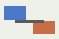

<!-- page: 1 -->
# 1 Overview
StreamFlow is a horizontally scalable platform for ingesting, processing, and
serving event streams. A deployment is composed of three planes: an ingestion
plane that accepts events, a processing plane that runs stateful operators, and
a storage plane that persists materialized results for low-latency queries.

## 1.1 Architecture at a Glance
The high-level data path is shown in the figure below: producers write to the
ingestion gateway, which partitions events onto the processing plane; processed
results are written to the storage plane and exposed through the query API.

<!-- page: 2 -->
# 2 Ingestion Plane
The ingestion gateway accepts events over HTTP and gRPC. Events are assigned to
partitions by a consistent hash of the partition key, so all events for a given
key are processed in order by a single operator instance.

## 2.1 Backpressure
When the processing plane lags, the gateway applies backpressure by returning
HTTP 429 with a Retry-After header. Producers must honor Retry-After; ignoring it
causes the gateway to shed load by dropping events beyond the configured buffer.

| Setting | Description | Default |
| --- | --- | --- |
| ingest.buffer_events | Per-partition buffer before shedding | 100000 |
| ingest.max_event_bytes | Maximum single event size | 1 MiB |
| ingest.ack_mode | When the gateway acks a write | on_persist |

<!-- page: 3 -->
# 3 Processing Plane
Operators are stateful and checkpoint their state to the storage plane every
checkpoint interval. On failure, an operator restarts from its last checkpoint
and replays events from the ingestion log since that checkpoint.

## 3.1 Exactly-Once Semantics
StreamFlow provides exactly-once processing by pairing idempotent sink writes
with checkpoint barriers. A result is only made visible to the query API after
the checkpoint that produced it is durably committed, so replays after a restart
never expose duplicate output.

<!-- page: 4 -->
# 4 Storage Plane
The storage plane keeps two representations: a write-optimized log for recent
results and a read-optimized columnar store for historical queries. A compaction
job merges log segments into the columnar store on a configurable schedule.

## 4.1 Query Freshness
Queries read from both representations and merge them, so results reflect data up
to the most recent committed checkpoint. The freshness lag is therefore bounded
by the checkpoint interval, which defaults to 10 seconds.
